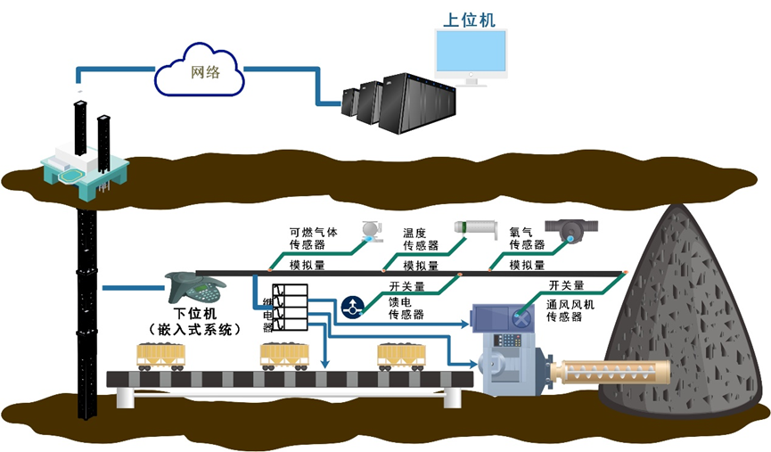
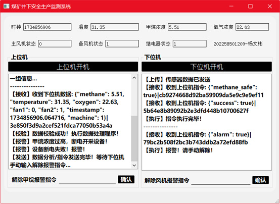

# 项目介绍

The underground production environment in coal mines is harsh, and to ensure the safety of workers, it is essential to monitor various environmental factors in real-time. The monitoring data can be classified into two categories: the first category consists of analog quantities, such as methane, gas, oxygen, carbon monoxide, carbon dioxide, and temperature (expressed in numerical values); the second category consists of binary quantities, such as ventilation fans, equipment operational status, and power supply sensors (expressed as 0 or 1, where 0 represents a disconnection and 1 represents a connection).

The system is divided into an upper-level computer (host) and a lower-level embedded system (field device) connected via network communication. The lower-level device is connected to various sensors and is equipped with multiple relays (input/output ports, capable of controlling the power supply to sensors). Sensor data is uploaded to the upper-level computer at regular intervals (every 5 seconds), and if there is a change in sensor values, it is immediately uploaded. Upon receiving the data from the lower-level system, the upper-level computer displays the values or statuses of the sensors and, based on predefined control rules, transmits control data to the lower-level device to manage the operation of the sensors.

 

煤矿井下生产环境恶劣，为保障井下人员的安全，需要实时对井下各种环境因素进行监控，监控数据主要分为两大类，第一类为模拟量：如甲烷，瓦斯，氧气，一氧化碳、二氧化碳、温度等（结果以数值表示），第二类为开关量：例如通风风机、设备运行状态、馈电传感器等（结果以0\1 表示，代表两个状态，0代表断开状态，1代表接通状态）。

系统分为上位机（计算机）和下位机（嵌入式系统），通过网络通信。下位机连接各种传感器，并设置多个继电器（进出端口，可实现对传感器的通断电），并将传感器数据定时上传到上位机（每5秒上传一次；如果传感器数值发生变化，则立即上传）。上位机收到下位机数据后，要显示收到的各个传感器的数值或者状态，并且根据控制规则向下位机传输控制数据，从而对各个传感器进行控制。

# 系统界面

# 详细介绍

**请查阅该库中的Word文档**。